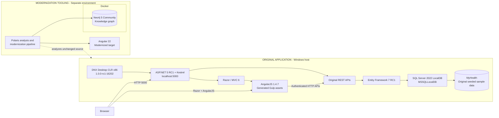

# Original HealthClinic.biz Legacy Environment

## 1. Purpose

This document records the verified environment used to run the untouched original Microsoft HealthClinic.biz application. The running application is the legacy baseline and behavioral reference for the Polaris modernization proof of concept (POC). Its source, project format, ASP.NET packages, Entity Framework packages, AngularJS application, routes, and database initialization code remain unchanged.

The legacy runtime and generated frontend files are isolated outside the Git repository. No credentials, passwords, tokens, or application secrets are recorded here.

## 2. Original Application

| Item | Verified value |
| --- | --- |
| Repository | `C:\Users\himan\OneDrive\Documents\polaris-modernization-poc\modernization\modernization` |
| Original source tree | `C:\Users\himan\OneDrive\Documents\polaris-modernization-poc\modernization\modernization\source\HealthClinic.biz` |
| Original web project | `C:\Users\himan\OneDrive\Documents\polaris-modernization-poc\modernization\modernization\source\HealthClinic.biz\src\MyHealth.Web` |
| Disposable runtime copy | `C:\Users\himan\AppData\Local\PolarisOriginalHealthClinicRun\current\HealthClinic.biz` |
| Runtime web project | `C:\Users\himan\AppData\Local\PolarisOriginalHealthClinicRun\current\HealthClinic.biz\src\MyHealth.Web` |
| Public URL | `http://localhost:5000/` |
| Dashboard URL | `http://localhost:5000/Dashboard#/dashboard` |
| Git checkpoint | `6ce220fa1bb680e11a88c5d644c05cd408110231` |
| Original source changed | No |

The following authenticated API requests were verified with the original login/session flow and the original `TenantId: 1` header behavior:

- `GET http://localhost:5000/api/reports/expenses/2026` returned HTTP 200 and seeded expense data.
- `GET http://localhost:5000/api/reports/patients/2026` returned HTTP 200 and seeded patient data.
- `GET http://localhost:5000/api/reports/clinicsummary` returned HTTP 200 and seeded clinic summary data.
- `GET http://localhost:5000/api/users/current/tenant` returned HTTP 200 and tenant ID `1`.

The year-specific report examples reflect the verification year. Use the current year when repeating them because the original initializer creates date-relative sample data.

## 3. Legacy Technology Stack

| Component | Version | Exact Path | Installation Type | Purpose |
| --- | --- | --- | --- | --- |
| Windows | Windows 11 Home `10.0.26200`, 64-bit | `C:\Windows` | Windows machine-level | Host operating system |
| ASP.NET hosting | `1.0.0-rc1-final` | `C:\Users\himan\AppData\Local\PolarisLegacyDnx\packages-cache\Microsoft.AspNet.Hosting\1.0.0-rc1-final` | Runtime-local NuGet package | Hosts the original ASP.NET 5 application |
| ASP.NET MVC | `6.0.0-rc1-final` | `C:\Users\himan\AppData\Local\PolarisLegacyDnx\packages-cache\Microsoft.AspNet.Mvc\6.0.0-rc1-final` | Runtime-local NuGet package | Razor, MVC controllers, and APIs |
| Kestrel | `1.0.0-rc1-final` | `C:\Users\himan\AppData\Local\PolarisLegacyDnx\packages-cache\Microsoft.AspNet.Server.Kestrel\1.0.0-rc1-final` | Runtime-local NuGet package | HTTP server on port 5000 |
| DNX Desktop CLR | `1.0.0-rc1-16202`, CLR x86 | `C:\Users\himan\AppData\Local\PolarisLegacyDnx\runtimes\dnx-clr-win-x86.1.0.0-rc1-final\bin\dnx.exe` | Bundled/runtime-local | Compiles and runs the xproj/project.json application |
| DNU | `1.0.0-rc1-16202`, CLR x86 | `C:\Users\himan\AppData\Local\PolarisLegacyDnx\runtimes\dnx-clr-win-x86.1.0.0-rc1-final\bin\dnu.cmd` | Bundled/runtime-local | Restores historical project.json dependencies |
| Entity Framework SQL Server | `7.0.0-rc1-final` | `C:\Users\himan\AppData\Local\PolarisLegacyDnx\packages-cache\EntityFramework.MicrosoftSqlServer\7.0.0-rc1-final` | Runtime-local NuGet package | Original data access and database initialization |
| SQL Server Express LocalDB | `16.0.1000.6` (SQL Server 2022) | `C:\Program Files\Microsoft SQL Server\160\Tools\Binn\SqlLocalDB.exe` | Windows machine-level | User-scoped SQL Server runtime |
| MyHealth database | Original EF7-created schema and seed data | `C:\Users\himan\MyHealth.mdf` | LocalDB user database | Original application data |
| Node.js | `v6.17.1` (Boron, x64) | `C:\Users\himan\AppData\Local\PolarisLegacyFrontend\node-v6.17.1-win-x64\node.exe` | Portable/runtime-local | Compatible host for Gulp 3 and node-sass 3 |
| npm | `3.10.10` | `C:\Users\himan\AppData\Local\PolarisLegacyFrontend\node-v6.17.1-win-x64\npm.cmd` | Bundled with portable Node | Restores project-local build dependencies |
| Bower CLI | `1.6.5` | `C:\Users\himan\AppData\Local\PolarisOriginalHealthClinicRun\current\HealthClinic.biz\src\MyHealth.Web\node_modules\.bin\bower.cmd` | Project-local in disposable copy | Restores original browser libraries |
| Gulp CLI/runtime | `3.8.11` | `C:\Users\himan\AppData\Local\PolarisOriginalHealthClinicRun\current\HealthClinic.biz\src\MyHealth.Web\node_modules\.bin\gulp.cmd` | Project-local in disposable copy | Runs the original asset pipeline |
| AngularJS | `1.4.7` | `C:\Users\himan\AppData\Local\PolarisOriginalHealthClinicRun\current\HealthClinic.biz\src\MyHealth.Web\content\lib\angular\angular.js` | Bower/project-local in disposable copy | Original browser application framework |
| Generated frontend | Original Gulp output | `C:\Users\himan\AppData\Local\PolarisOriginalHealthClinicRun\current\HealthClinic.biz\src\MyHealth.Web\wwwroot` | Generated/runtime-local | CSS, JavaScript, templates, images, fonts, and vendor bundles |

Resolved direct npm build dependencies include `babelify 6.4.0`, `browserify 11.2.0`, `gulp-babel 5.3.0`, `gulp-sass 2.3.2`, `node-sass 3.13.1`, `gulp-uglify 1.2.0`, `main-bower-files 2.13.3`, and the exact `gulp 3.8.11` requested by `package.json`.

Resolved Bower browser dependencies include AngularJS `1.4.7`, angular-animate `1.4.7`, angular-bootstrap `0.14.3`, angular-ui-router `0.2.18`, AngularJS Toaster (package metadata `0.4.18`, resolved tag `0.4.181`), Bootstrap `3.3.5`, Chart.js `1.0.2`, Hammer.js `2.0.4`, jQuery `2.1.4`, and jQuery Validation `1.11.1`.

## 4. Exact Installation Locations

```text
Repository:
C:\Users\himan\OneDrive\Documents\polaris-modernization-poc\modernization\modernization

Original source:
C:\Users\himan\OneDrive\Documents\polaris-modernization-poc\modernization\modernization\source\HealthClinic.biz

Disposable application copy:
C:\Users\himan\AppData\Local\PolarisOriginalHealthClinicRun\current\HealthClinic.biz

DNX runtime root:
C:\Users\himan\AppData\Local\PolarisLegacyDnx\runtimes\dnx-clr-win-x86.1.0.0-rc1-final

DNX/DNU executable directory:
C:\Users\himan\AppData\Local\PolarisLegacyDnx\runtimes\dnx-clr-win-x86.1.0.0-rc1-final\bin

Historical .NET package cache:
C:\Users\himan\AppData\Local\PolarisLegacyDnx\packages-cache

Portable Node runtime:
C:\Users\himan\AppData\Local\PolarisLegacyFrontend\node-v6.17.1-win-x64

Portable npm cache:
C:\Users\himan\AppData\Local\PolarisLegacyFrontend\npm-cache

Project-local npm modules:
C:\Users\himan\AppData\Local\PolarisOriginalHealthClinicRun\current\HealthClinic.biz\src\MyHealth.Web\node_modules

Bower components (configured by .bowerrc):
C:\Users\himan\AppData\Local\PolarisOriginalHealthClinicRun\current\HealthClinic.biz\src\MyHealth.Web\content\lib

Generated web root:
C:\Users\himan\AppData\Local\PolarisOriginalHealthClinicRun\current\HealthClinic.biz\src\MyHealth.Web\wwwroot

LocalDB utility:
C:\Program Files\Microsoft SQL Server\160\Tools\Binn\SqlLocalDB.exe

LocalDB instance system files/logs:
C:\Users\himan\AppData\Local\Microsoft\Microsoft SQL Server Local DB\Instances\MSSQLLocalDB

MyHealth data file:
C:\Users\himan\MyHealth.mdf

MyHealth log file:
C:\Users\himan\MyHealth_log.ldf
```

No DNX, DNU, Bower, or Gulp command is globally installed on `PATH`. Commands in this document use verified absolute paths or temporarily prepend portable Node to the current process's `PATH`.

## 5. Database Setup

- Database technology: Microsoft SQL Server 2022 Express LocalDB `16.0.1000.6`.
- Instance: automatic user instance `(localdb)\MSSQLLocalDB`.
- Owner: `LAPTOP-O28N6CEC\himan`.
- Database: `MyHealth`.
- Data file: `C:\Users\himan\MyHealth.mdf`.
- Log file: `C:\Users\himan\MyHealth_log.ldf`.
- Connection: Windows integrated security through the unchanged application connection string.
- Schema: created naturally by `MyHealthDataInitializer.InitializeDatabaseAsync` through EF7.
- Data: original HealthClinic seeded sample data, not production or customer data.

LocalDB is an on-demand user process. It can report `Stopped` after an idle period even while Kestrel remains active; the next database connection starts it automatically. It can also be started explicitly:

```powershell
$sqlLocalDb = 'C:\Program Files\Microsoft SQL Server\160\Tools\Binn\SqlLocalDB.exe'
& $sqlLocalDb start MSSQLLocalDB
& $sqlLocalDb info MSSQLLocalDB
```

Verify database files through SQL metadata without installing SSMS or sqlcmd:

```powershell
Add-Type -AssemblyName System.Data
$connection = [System.Data.SqlClient.SqlConnection]::new(
    'Server=(localdb)\MSSQLLocalDB;Database=master;Integrated Security=true;Connect Timeout=30'
)
$connection.Open()
$command = $connection.CreateCommand()
$command.CommandText = @"
SELECT DB_NAME(database_id) AS DatabaseName,
       type_desc AS FileType,
       physical_name AS PhysicalPath
FROM sys.master_files
WHERE database_id = DB_ID('MyHealth')
ORDER BY file_id
"@
$reader = $command.ExecuteReader()
$table = [System.Data.DataTable]::new()
$table.Load($reader)
$connection.Close()
$table
```

Do not manually create the schema or seed rows. On a fresh database, start the unchanged application and allow its initializer to do that work.

## 6. Frontend Build Setup

The verified original pipeline is:

```text
portable Node.js 6.17.1 + npm 3.10.10
  -> npm project-local build dependencies
  -> Bower 1.6.5 and bower.json browser dependencies
  -> original Gulp 3.8.11 default task
  -> wwwroot CSS/JS/templates/images/fonts
  -> AngularJS 1.4.7 dashboard
```

The original `gulp default` task runs both `build` and `build:min`. Its subtasks:

- copy images, fonts, and favicon;
- copy AngularJS HTML templates;
- compile Sass into public/private CSS and minified CSS;
- concatenate Bower JavaScript into `lib.js` and `lib.min.js`;
- transpile and concatenate site JavaScript;
- Browserify/Babel the AngularJS application into `app.js` and `app.min.js`.

Run the following only in the disposable web project:

```powershell
$web = 'C:\Users\himan\AppData\Local\PolarisOriginalHealthClinicRun\current\HealthClinic.biz\src\MyHealth.Web'
$nodeRoot = 'C:\Users\himan\AppData\Local\PolarisLegacyFrontend\node-v6.17.1-win-x64'
$env:PATH = "$nodeRoot;$env:PATH"
$env:npm_config_cache = 'C:\Users\himan\AppData\Local\PolarisLegacyFrontend\npm-cache'
Set-Location $web

& "$nodeRoot\npm.cmd" install --ignore-scripts
& "$nodeRoot\npm.cmd" install bower@1.6.5 --no-save --ignore-scripts
& "$web\node_modules\.bin\bower.cmd" install --config.interactive=false
& "$nodeRoot\npm.cmd" rebuild node-sass
& "$web\node_modules\.bin\gulp.cmd" default
```

`--ignore-scripts` prevents the root package's `postinstall` from prematurely running Bower/Gulp. `npm rebuild node-sass` then executes only node-sass's required installation step. Bower and Gulp work without global installation because their command shims are under the disposable project's `node_modules\.bin` directory and are invoked by absolute path.

Bower `1.6.5` is historical and has known security warnings. It is used only in the disposable legacy build environment to preserve original compatibility. Do not use this runtime for unrelated packages or general development.

Verified generated files include:

```text
wwwroot\css\public-site.min.css
wwwroot\css\private-site.min.css
wwwroot\lib\js\lib.min.js
wwwroot\js\site.min.js
wwwroot\app\app.js
wwwroot\app\components\dashboard\views\main.html
wwwroot\images\public\logo_home.png
```

## 7. How the Application Actually Runs

```text
Windows 11 host
  -> DNX Desktop CLR x86 1.0.0-rc1-16202
  -> ASP.NET 5 RC1 / MVC 6 RC1 / Kestrel RC1
  -> MyHealth.Web Razor pages and REST controllers
  -> EF7 RC1 SQL Server provider
  -> SQL Server 2022 LocalDB MSSQLLocalDB
  -> MyHealth database

Browser
  -> Kestrel http://localhost:5000
  -> Razor private layout
  -> generated vendor/site/app JavaScript and CSS
  -> AngularJS 1.4.7 + UI Router
  -> original HealthClinic REST APIs
  -> original MyHealth seeded sample data
```

The application is not running through IIS Express, modern .NET, ASP.NET Core, a replacement API, a compatibility host, or Docker.

## 8. Docker Usage

The original HealthClinic.biz application has no Docker dependency and is not containerized. DNX, Kestrel, LocalDB, Node, Bower, Gulp, AngularJS, and MyHealth all run directly on Windows or from user-local Windows directories.

At verification time, Docker `29.7.2` was running one container:

```text
modernization-neo4j-1 | neo4j:5-community | ports 7474 and 7687
```

Neo4j belongs to the Polaris modernization knowledge-graph environment and is NOT required to run the original HealthClinic.biz application.

## 9. Start HealthClinic

### Everyday startup after reboot

The frontend build is not required each day if the generated files remain in the disposable `wwwroot` directory.

Open PowerShell and run:

```powershell
$sqlLocalDb = 'C:\Program Files\Microsoft SQL Server\160\Tools\Binn\SqlLocalDB.exe'
$dnx = 'C:\Users\himan\AppData\Local\PolarisLegacyDnx\runtimes\dnx-clr-win-x86.1.0.0-rc1-final\bin\dnx.exe'
$web = 'C:\Users\himan\AppData\Local\PolarisOriginalHealthClinicRun\current\HealthClinic.biz\src\MyHealth.Web'

& $sqlLocalDb start MSSQLLocalDB
$env:DNX_PACKAGES = 'C:\Users\himan\AppData\Local\PolarisLegacyDnx\packages-cache'
Set-Location $web
& $dnx web
```

Keep that PowerShell window open. Wait for:

```text
Now listening on: http://localhost:5000
Application started. Press Ctrl+C to shut down.
```

Then open:

```text
http://localhost:5000/Dashboard#/dashboard
```

The dashboard is protected. Authenticate through the original login page using credentials supplied through the authorized project process. Credentials are intentionally omitted from this document.

### Rebuild frontend only when necessary

Run the commands in section 6 only if `wwwroot` was removed, the disposable staging copy was recreated, or asset checks return 404. Do not run the historical npm/Bower restore as routine daily startup.

## 10. Stop HealthClinic

If HealthClinic is running in the foreground, press `Ctrl+C` in its PowerShell window.

If the window is unavailable, identify the process listening on port 5000 and stop it only after verifying the executable path:

```powershell
$expectedDnx = 'C:\Users\himan\AppData\Local\PolarisLegacyDnx\runtimes\dnx-clr-win-x86.1.0.0-rc1-final\bin\dnx.exe'
$listener = Get-NetTCPConnection -LocalPort 5000 -State Listen -ErrorAction SilentlyContinue
if ($listener) {
    $process = Get-CimInstance Win32_Process -Filter "ProcessId=$($listener.OwningProcess)"
    if ($process.ExecutablePath -eq $expectedDnx) {
        Stop-Process -Id $listener.OwningProcess
    } else {
        throw "Port 5000 belongs to an unexpected process: $($process.ExecutablePath)"
    }
}
```

Optionally stop LocalDB after stopping HealthClinic:

```powershell
& 'C:\Program Files\Microsoft SQL Server\160\Tools\Binn\SqlLocalDB.exe' stop MSSQLLocalDB
```

Do not stop Docker/Neo4j as part of stopping HealthClinic; it is a separate Polaris service.

## 11. Verify HealthClinic

### Runtime, process, port, and HTTP assets

```powershell
$dnx = 'C:\Users\himan\AppData\Local\PolarisLegacyDnx\runtimes\dnx-clr-win-x86.1.0.0-rc1-final\bin\dnx.exe'
$dnu = 'C:\Users\himan\AppData\Local\PolarisLegacyDnx\runtimes\dnx-clr-win-x86.1.0.0-rc1-final\bin\dnu.cmd'
& $dnx --version
& $dnu --version

Get-NetTCPConnection -LocalPort 5000 -State Listen
(Invoke-WebRequest 'http://localhost:5000/' -UseBasicParsing).StatusCode
(Invoke-WebRequest 'http://localhost:5000/css/public-site.min.css' -UseBasicParsing).StatusCode
(Invoke-WebRequest 'http://localhost:5000/lib/js/lib.min.js' -UseBasicParsing).StatusCode
(Invoke-WebRequest 'http://localhost:5000/app/app.js' -UseBasicParsing).StatusCode
```

Each HTTP command should return `200`.

### LocalDB and database

```powershell
$sqlLocalDb = 'C:\Program Files\Microsoft SQL Server\160\Tools\Binn\SqlLocalDB.exe'
& $sqlLocalDb versions
& $sqlLocalDb info MSSQLLocalDB
Test-Path 'C:\Users\himan\MyHealth.mdf'
Test-Path 'C:\Users\himan\MyHealth_log.ldf'
```

### Node, npm, Bower, Gulp, and generated assets

```powershell
$nodeRoot = 'C:\Users\himan\AppData\Local\PolarisLegacyFrontend\node-v6.17.1-win-x64'
$web = 'C:\Users\himan\AppData\Local\PolarisOriginalHealthClinicRun\current\HealthClinic.biz\src\MyHealth.Web'
$env:PATH = "$nodeRoot;$env:PATH"
& "$nodeRoot\node.exe" --version
& "$nodeRoot\npm.cmd" --version
& "$web\node_modules\.bin\bower.cmd" --version
& "$web\node_modules\.bin\gulp.cmd" --version

Test-Path "$web\wwwroot\css\public-site.min.css"
Test-Path "$web\wwwroot\css\private-site.min.css"
Test-Path "$web\wwwroot\lib\js\lib.min.js"
Test-Path "$web\wwwroot\js\site.min.js"
Test-Path "$web\wwwroot\app\app.js"
```

### Authenticated APIs

The following copy/paste script prompts for the seeded user's password and does not store it in this document:

```powershell
$credential = Get-Credential -UserName 'User' -Message 'Enter the authorized seeded HealthClinic password'
$login = Invoke-WebRequest 'http://localhost:5000/Account/Login' -SessionVariable healthSession -UseBasicParsing
$token = [regex]::Match(
    $login.Content,
    'name="__RequestVerificationToken"[^>]*value="([^"]+)"',
    'IgnoreCase'
).Groups[1].Value
$body = @{
    UserName = $credential.UserName
    Password = $credential.GetNetworkCredential().Password
    __RequestVerificationToken = $token
}
Invoke-WebRequest 'http://localhost:5000/Account/Login' `
    -Method Post -Body $body -WebSession $healthSession `
    -UseBasicParsing -MaximumRedirection 10 | Out-Null

$year = (Get-Date).Year
$paths = @(
    "/api/reports/expenses/$year",
    "/api/reports/patients/$year",
    '/api/reports/clinicsummary',
    '/api/users/current/tenant'
)
foreach ($path in $paths) {
    $response = Invoke-WebRequest "http://localhost:5000$path" `
        -WebSession $healthSession -Headers @{ TenantId = '1' } -UseBasicParsing
    [pscustomobject]@{ Path = $path; Status = $response.StatusCode; Bytes = $response.RawContentLength }
}
```

### Dashboard browser verification

Open `http://localhost:5000/Dashboard#/dashboard`, authenticate normally, and verify the dashboard cards and both charts. The verified browser run reported AngularJS `1.4.7`, a live Angular injector, a populated `ui-view`, no localhost request failures, no JavaScript page exceptions, and no broken images.

Two HTTP 400 console messages from `https://dc.services.visualstudio.com/v2/track` were observed because the unchanged repository contains a placeholder Application Insights instrumentation key. They are external telemetry failures and did not prevent application or dashboard startup.

## 12. Fresh Machine Setup

These steps reproduce the verified Windows architecture. The historical components are unsupported and should be isolated to a development/POC machine.

### ONE-TIME INSTALLATION

1. Clone or copy the repository to the exact repository path shown in section 2, or update every path in this procedure consistently.
2. Install only Microsoft SQL Server 2022 Express LocalDB from Microsoft's official distribution. The verified product is `Microsoft SQL Server 2022 LocalDB 16.0.1000.6`; its MSI requires an elevated administrator process.
3. Stage the signed DNX RC1 NuGet runtime outside the repository.
4. Stage portable Node.js 6.17.1 outside the repository.
5. Copy the complete original `HealthClinic.biz` tree to a disposable location, restore DNX packages, then run the original frontend pipeline.
6. Start the application once and allow the original initializer to create and seed `MyHealth`.

#### LocalDB media and installation

Run the MSI installation from an elevated PowerShell window:

```powershell
$installRoot = 'C:\Users\himan\AppData\Local\PolarisLocalDbInstall'
New-Item -ItemType Directory -Force -Path $installRoot | Out-Null
$bootstrapper = Join-Path $installRoot 'SQL2022-SSEI-Expr.exe'
Invoke-WebRequest 'https://download.microsoft.com/download/5/1/4/5145fe04-4d30-4b85-b0d1-39533663a2f1/SQL2022-SSEI-Expr.exe' -OutFile $bootstrapper
Get-AuthenticodeSignature $bootstrapper

$media = Join-Path $installRoot 'media'
& $bootstrapper /Action=Download /MediaType=LocalDB "/MediaPath=$media" /Quiet
$msi = Join-Path $media 'en-US\SqlLocalDB.msi'
Get-AuthenticodeSignature $msi
& "$env:SystemRoot\System32\msiexec.exe" /i $msi /qn /norestart IACCEPTSQLLOCALDBLICENSETERMS=YES
```

The verified MSI SHA-256 was `224D483992EF60368DAC70CEA174DCFAF43A3CA06ADA331C67DC6119A26490F6` and its Authenticode signer was Microsoft Corporation. Microsoft can update download content; on a fresh machine, require a valid Microsoft signature rather than blindly accepting this historical hash.

#### DNX runtime

```powershell
$dnxRoot = 'C:\Users\himan\AppData\Local\PolarisLegacyDnx'
$dnxPackageDir = Join-Path $dnxRoot 'packages'
$runtime = Join-Path $dnxRoot 'runtimes\dnx-clr-win-x86.1.0.0-rc1-final'
New-Item -ItemType Directory -Force -Path $dnxPackageDir,$runtime | Out-Null

$dnxPackage = Join-Path $dnxPackageDir 'dnx-clr-win-x86.1.0.0-rc1-final.nupkg'
Invoke-WebRequest `
    'https://api.nuget.org/v3-flatcontainer/dnx-clr-win-x86/1.0.0-rc1-final/dnx-clr-win-x86.1.0.0-rc1-final.nupkg' `
    -OutFile $dnxPackage
Get-FileHash $dnxPackage -Algorithm SHA256
& 'C:\Program Files\dotnet\dotnet.exe' nuget verify $dnxPackage --all
tar -xf $dnxPackage -C $runtime
```

The verified DNX package SHA-256 was `11B6F825F826FF2D3DAB02513B9312210A677A2ED00D4014937AA7008504EAEB`, and `dotnet nuget verify --all` validated its NuGet.org repository signature.

The 2015 client requires a process-local TLS compatibility configuration to communicate with current NuGet.org. Create this runtime-only file at `C:\Users\himan\AppData\Local\PolarisLegacyDnx\runtimes\dnx-clr-win-x86.1.0.0-rc1-final\bin\dnx.exe.config`:

```xml
<?xml version="1.0" encoding="utf-8"?>
<configuration>
  <runtime>
    <AppContextSwitchOverrides value="Switch.System.Net.DontEnableSchUseStrongCrypto=false;Switch.System.Net.DontEnableSystemDefaultTlsVersions=false" />
  </runtime>
</configuration>
```

#### Portable Node.js

```powershell
$frontendRoot = 'C:\Users\himan\AppData\Local\PolarisLegacyFrontend'
$nodeZip = Join-Path $frontendRoot 'node-v6.17.1-win-x64.zip'
New-Item -ItemType Directory -Force -Path $frontendRoot | Out-Null
Invoke-WebRequest 'https://nodejs.org/download/release/v6.17.1/node-v6.17.1-win-x64.zip' -OutFile $nodeZip
$hash = (Get-FileHash $nodeZip -Algorithm SHA256).Hash
if ($hash -ne '85A7110C2E2CDAA76C5CAD4512395EB13034FFFD2C6AEA3ECA7E61797959DAD7') {
    throw "Unexpected Node archive SHA-256: $hash"
}
Expand-Archive $nodeZip -DestinationPath $frontendRoot
```

#### Disposable application and dependency restoration

```powershell
$repositorySource = 'C:\Users\himan\OneDrive\Documents\polaris-modernization-poc\modernization\modernization\source\HealthClinic.biz'
$runParent = 'C:\Users\himan\AppData\Local\PolarisOriginalHealthClinicRun\current'
$stagedSource = Join-Path $runParent 'HealthClinic.biz'
if (Test-Path $stagedSource) {
    throw 'Disposable staging already exists. Preserve it or review and remove it manually before recreating.'
}
New-Item -ItemType Directory -Force -Path $runParent | Out-Null
Copy-Item -LiteralPath $repositorySource -Destination $stagedSource -Recurse

$dnu = 'C:\Users\himan\AppData\Local\PolarisLegacyDnx\runtimes\dnx-clr-win-x86.1.0.0-rc1-final\bin\dnu.cmd'
$packages = 'C:\Users\himan\AppData\Local\PolarisLegacyDnx\packages-cache'
& $dnu restore (Join-Path $stagedSource 'src') --packages $packages --parallel
```

Run the frontend commands from section 6. Then run the everyday startup commands from section 9. The first successful application startup creates and seeds `MyHealth` naturally.

### EVERYDAY STARTUP

Everyday startup consists only of:

1. Start `MSSQLLocalDB` (optional but explicit and useful for diagnostics).
2. Set `DNX_PACKAGES` to the verified package cache.
3. Run `dnx.exe web` from the disposable `MyHealth.Web` directory.
4. Open the dashboard and authenticate normally.

Do not repeat LocalDB installation, DNX extraction, DNU restore, npm restore, Bower restore, or Gulp build unless that corresponding runtime/cache/output is missing.

## 13. Troubleshooting

### DNX or DNU not found on PATH

Verified solution: use the absolute runtime-local paths in sections 9 and 11. DNX and DNU are intentionally not globally installed.

### DNU fails with `Could not create SSL/TLS secure channel`

Verified solution: place the documented `dnx.exe.config` beside the isolated `dnx.exe`. This opts only that process into strong/system-default TLS; it does not change the registry or application source.

### DNU build reports missing referenced-project dependencies

Verified solution: restore the complete staged `src` directory, not only `src\MyHealth.Web`, so each referenced project receives its own `project.lock.json`.

### LocalDB or sqllocaldb is not found on PATH

Verified solution: invoke `C:\Program Files\Microsoft SQL Server\160\Tools\Binn\SqlLocalDB.exe` directly. LocalDB was installed from the Microsoft-signed SQL Server 2022 LocalDB MSI. Installation requires administrator elevation.

### LocalDB reports `Stopped`

This is normal after idle time. Start it explicitly with `SqlLocalDB.exe start MSSQLLocalDB`, or allow the next application database connection to auto-start it.

### Database initialization fails because LocalDB is unavailable

Verified solution: install/start the exact `MSSQLLocalDB` instance without changing `appsettings.json`, then restart the application. The original initializer creates `MyHealth` and its seed data.

### Bower or Gulp is not found globally

Verified solution: do not install either globally. Invoke the project-local command shims in staged `node_modules\.bin` using the commands in section 6.

### Current global Node fails with Gulp 3

Verified solution: do not downgrade global Node. Use the portable Node.js 6.17.1 runtime. It supplies npm 3.10.10 and the ABI required by node-sass 3.13.1.

### CSS/JavaScript/images return HTTP 404

Cause: the original repository does not check generated assets into `wwwroot`; it initially contains only `web.config`.

Verified solution: restore npm and Bower dependencies and run the unmodified `gulp default` task in the disposable copy. Do not hand-create bundles and do not generate files in the repository source tree.

### Port 5000 is already in use

Use `Get-NetTCPConnection -LocalPort 5000 -State Listen`, inspect the owning process and command line, and stop it only if it is the stale isolated DNX process. The verified safe stop command is in section 10.

### Application Insights requests return HTTP 400

The unchanged repository contains a placeholder instrumentation key. Browser verification observed two external telemetry 400 responses from `dc.services.visualstudio.com`; they were non-fatal and all localhost application requests succeeded. Changing telemetry configuration was not required to run the original dashboard.

### Unverified suggestions

None are required for the current verified machine. If a future Windows/Node/NuGet service change breaks this procedure, record the new evidence and label any proposed workaround `UNKNOWN / REQUIRES VERIFICATION` until tested.

## 14. Modernization POC Relationship

```text
Original HealthClinic.biz -> legacy baseline and behavioral reference
Polaris                  -> analysis, knowledge graph, application understanding, and modernization pipeline
Neo4j                    -> Polaris knowledge graph storage
Angular 22               -> modernized target application
```

The original HealthClinic source remains unchanged. Generated frontend assets, project lock files, restored packages, portable runtimes, and browser verification artifacts live outside the repository.

## 15. Environment Architecture



Docker/Neo4j and Angular 22 are not on the original application's runtime path.

## 16. Verified Environment Snapshot

```text
HEALTHCLINIC_RUNNING=YES
ORIGINAL_APP_URL=http://localhost:5000/
ORIGINAL_DASHBOARD_URL=http://localhost:5000/Dashboard#/dashboard
HEALTHCLINIC_DOCKERIZED=NO
RUNTIME_TYPE=DNX Desktop CLR x86
RUNTIME_VERSION=1.0.0-rc1-16202
RUNTIME_PATH=C:\Users\himan\AppData\Local\PolarisLegacyDnx\runtimes\dnx-clr-win-x86.1.0.0-rc1-final\bin\dnx.exe
DATABASE_TYPE=Microsoft SQL Server 2022 Express LocalDB 16.0.1000.6
DATABASE_INSTANCE=(localdb)\MSSQLLocalDB
DATABASE_PATH=C:\Users\himan\MyHealth.mdf; C:\Users\himan\MyHealth_log.ldf
NODE_VERSION=v6.17.1
NODE_PATH=C:\Users\himan\AppData\Local\PolarisLegacyFrontend\node-v6.17.1-win-x64\node.exe
NPM_VERSION=3.10.10
BOWER_VERSION=1.6.5
BOWER_PATH=C:\Users\himan\AppData\Local\PolarisOriginalHealthClinicRun\current\HealthClinic.biz\src\MyHealth.Web\node_modules\.bin\bower.cmd
GULP_VERSION=3.8.11
GULP_PATH=C:\Users\himan\AppData\Local\PolarisOriginalHealthClinicRun\current\HealthClinic.biz\src\MyHealth.Web\node_modules\.bin\gulp.cmd
ANGULARJS_VERSION=1.4.7
ANGULARJS_PATH=C:\Users\himan\AppData\Local\PolarisOriginalHealthClinicRun\current\HealthClinic.biz\src\MyHealth.Web\content\lib\angular\angular.js
START_COMMAND=C:\Users\himan\AppData\Local\PolarisLegacyDnx\runtimes\dnx-clr-win-x86.1.0.0-rc1-final\bin\dnx.exe web
SOURCE_CHANGED=NO
POLARIS_CHANGED=NO
WORKTREE_CLEAN=NO (this documentation file is intentionally uncommitted)
VERIFIED_DATE=2026-09-03 13:57:32 -06:00
```
